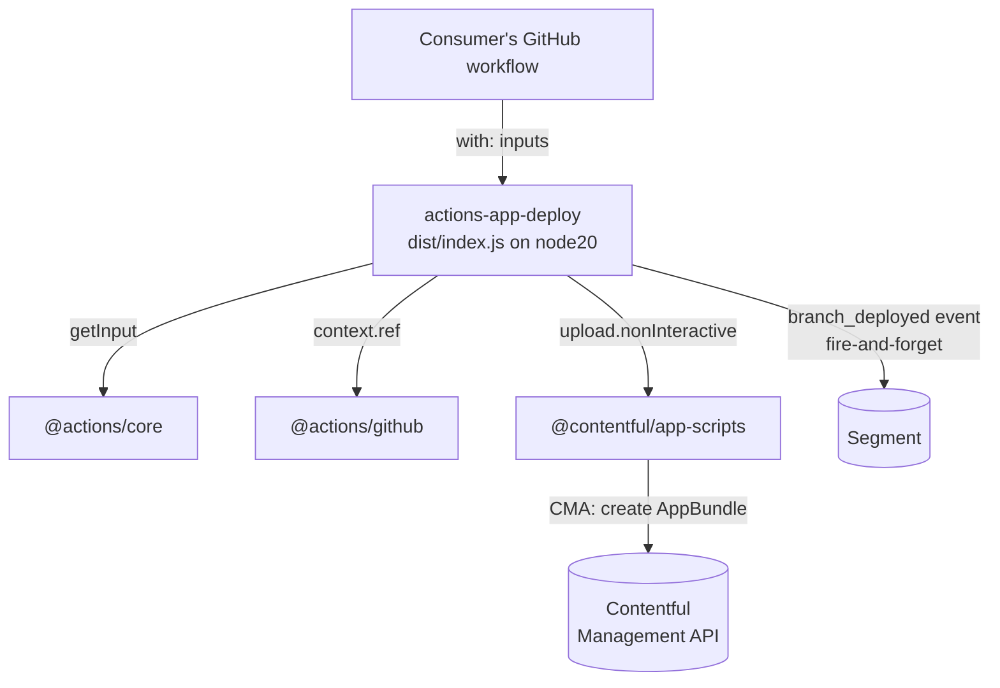

# Architecture — actions-app-deploy

## Overview

`actions-app-deploy` is a single-purpose GitHub Action that uploads a built frontend bundle to
Contentful App Hosting and creates an `AppBundle` against an app definition. It is the CI-facing
wrapper around `@contentful/app-scripts`' non-interactive upload path: consumers add one step to a
workflow instead of scripting a CMA upload themselves.

It is not a service. It has no runtime of its own, no state, and no deployment — it is a versioned
bundle of JavaScript that GitHub executes inside the consumer's runner.

**Design principle: a thin, boring wrapper.** All upload logic — bundle packing, CMA calls,
retries — belongs to `@contentful/app-scripts`. This repo owns exactly three things: the input
contract in `action.yml`, translating those inputs into an `upload.nonInteractive()` call, and one
opt-out telemetry event. Logic that grows here should usually grow in `app-scripts` instead.

## System Context

Upstream callers are third-party and internal workflows that reference
`contentful/actions-app-deploy@v1`. There are no downstream services; the only side effects are an
`AppBundle` in the target organization and one analytics event.

## Internal Structure

Three TypeScript files, compiled by `tsc` and then bundled by `@vercel/ncc` into a single
`dist/index.js` with no `node_modules` at runtime.

| Path | Purpose |
|---|---|
| `action.yml` | The public contract: six inputs, `runs.using: node20`, `runs.main: dist/index.js`. The only file consumers depend on structurally. |
| `src/index.ts` | Entry point. Reads inputs, fires telemetry, delegates to `upload.nonInteractive()`, converts any throw into `core.setFailed()`. |
| `src/analytics.ts` | One Segment `track` call, hardcoded public write key, all errors swallowed. |
| `typings/index.d.ts` | Ambient declarations for untyped imports. |
| `dist/` | Committed `ncc` output — `index.js` plus `licenses.txt`. This is what actually runs. |

## Data Flow

1. GitHub resolves `contentful/actions-app-deploy@<ref>` and executes `dist/index.js` under node20.
2. `deploy()` reads six inputs via `core.getInput`: `organization-id`, `app-definition-id`,
   `access-token`, `folder`, `comment` (optional), `allow-tracking` (optional, default `true`).
3. The deployed ref is read from `github.context.ref` — this is the raw ref (e.g.
   `refs/heads/main`), not a bare branch name, and is sent as `branch_name`.
4. `track()` fires a `branch_deployed` event unless `allow-tracking` is the string `"false"`.
   `anonymousId` is `Date.now()`, so events are not correlatable across runs by design.
5. `upload.nonInteractive()` packs `folder` and creates the `AppBundle`, tagged with
   `userAgentApplication: "contentful.actions-app-deploy"` so App Hosting can attribute bundles
   to this Action.
6. Any error becomes `core.setFailed(message)` — the step fails, the workflow decides what next.
   There is no retry and no partial-upload cleanup.

## Domain Concepts

- **App definition** — the org-level record of a Contentful App. Identified by
  `app-definition-id`; the Action never creates one (`contentful-app-scripts
  create-app-definition` does).
- **AppBundle** — one immutable uploaded build of an app's frontend. Each successful run creates a
  new bundle. Activating a bundle is a *separate* step this Action does not perform: uploading is
  not releasing.
- **`comment`** — free-text label attached to the bundle, the only way to tell bundles apart in
  the UI. Consumers typically pass a commit SHA or PR number.

## Key Dependencies

| Dependency | Why it's here |
|---|---|
| `@contentful/app-scripts` | Owns the entire upload/CMA path. The substance of this Action. |
| `@actions/core` | Input reading and failure signalling. |
| `@actions/github` | Only for `context.ref`. |
| `analytics-node` | Segment client. Note: `analytics-node` is a deprecated upstream package. |
| `@vercel/ncc` | Bundles to the single committed `dist/index.js`. |

## Configuration

There is no config file. The six `action.yml` inputs are the whole surface. `access-token` is a
CMA personal access token supplied by the consumer's secrets — it is passed straight through to
`app-scripts` and never logged.

## Operational Knowledge

- **Releases are floating major tags, not npm publishes.** Consumers pin `@v1`. A release moves
  the `v1` tag to the new commit alongside a specific `vX.Y.Z` tag — `v1` and `v1.1.0` currently
  point at the same commit (`6733526`). See
  [the release ADR](./docs/ADRs/2024-07-19-floating-major-version-tag-release.md).
- **Failure modes are the consumer's problem, visibly.** A bad token, a missing folder, or a CMA
  rejection all surface as a failed step with the underlying message. This Action adds no
  diagnostics of its own.
- **Verification is bundle-freshness, not tests.** See
  [the committed-bundle ADR](./docs/ADRs/2022-12-15-committed-ncc-bundle.md) and the CI section of
  [CONTRIBUTING.md](./CONTRIBUTING.md).
- **Almost all recent commits are Renovate dependency bumps.** The functional surface has been
  stable since 2024; treat behavior changes here as high-blast-radius, because every consumer
  tracking `v1` picks them up immediately without opting in.
